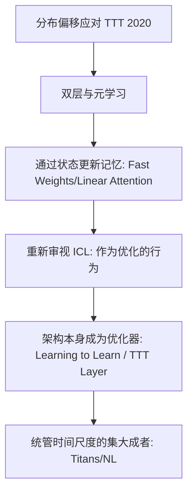

# 第 1 章：术语与地质勘探图

## 本章想回答什么问题？
当你听到“Test-time Update”、“Meta Learning”、“ICL”和“Learn to Learn”这四个名词在各种论文里乱飞的时候，它们指的到底是改变啥？有参数更新吗？有梯度吗？
我们急需一副地图来规范用语。

## 双线史观的最小例子 (Toy Example)

我们一开始必须明确区分关于“Test-Time Training (TTT)”这个词背后的两条不同的历史线索：

**线索一：狭义的 TTT (TTT 2020 范式)**
这群研究人员关注的问题是“分布偏移 (Distribution Shift)”。他们提议：对于每一个测试样本 $x_{test}$，我们现场执行几步标准的网络参数梯度下降微调，利用它完成一个自回归的预训练打底任务，然后去获得最终结果。
**一句话**：外挂利用 SGD，改变硬装参数（Weights）。

**线索二：广义的推断期学习 (TTT-Layer/ICL 等新范式)**
这群研究人员关注的是序列模型处理流数据的能力。在整个模型的隐状态（Hidden States）通过 $s_{t+1} = f(s_t, x_t)$ 进行更新的每一刻，这个状态转移律虽然在训练完之后是固定的，但他正在发生的信息挤压和提炼，在宏观层面上**等价于由于某个内部子任务而引发的某种梯度修饰**。
**一句话**：不用外部 SGD 计算梯度流，状态的流转本身构成了内化参数（State Parameters）的有效演进。

## 直觉解释
区分这二者的核心，就是看“更新的对象”在代码里究竟是 `model.parameters()` 还是 `hidden_state`。如果你能在不调用 `.backward()` 的前提下使得系统表现出接连适应的能力，那就是第二种。但实际上，随着时间的推移，学界发现这两种手段是高度“哲学同构”的。

## 核心地图

这张图是我们整本教材的缩影。

## 常见误解
- **误解**：“只要是写了 Test Time Training，就是指需要把测试数据喂进反向传播再跑一遍。”
- **纠正**：在 2024 年之后的文献中，越来越流行指代基于隐变量自我修改的过程，反向传播并未发生，它只是一个“模拟行为”。

## 练习题
1.1 请列举改变 `Weights` 与改变 `Hidden State` 对当前硬件架构速度（推理延迟）的潜在影响。
